# Rapport de Laboratoire : Sécurité des Applications Mobiles
## LAB 12 — Bypass de la Détection de Root Android avec Medusa & Frida

**Étudiante :** Chaira Hajar  
**Sujet :** Instrumentation dynamique pour le contournement de mécanismes de sécurité (Root Detection)  

---

## Introduction
La détection de root est une mesure de protection implémentée par les développeurs d'applications mobiles pour empêcher l'exécution de leur code sur des appareils compromis. Ce rapport détaille la méthodologie utilisée pour neutraliser les protections de l'application RootBeer Sample en utilisant exclusivement le framework Medusa.

---

## Étape 1 : Préparation de l'Environnement

### 1.1 Vérification des Outils PC
Validation de l'installation de Python, ADB et Frida sur la machine hôte.

> [!NOTE]
> 
> 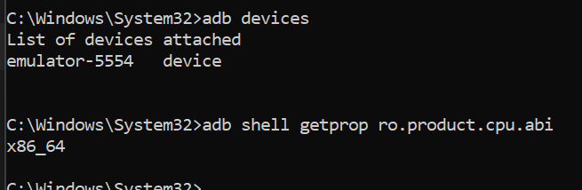

### 1.2 Déploiement de Frida-Server
Lancement de l'agent Frida en mode super-utilisateur sur l'appareil cible.

> [!NOTE]
> 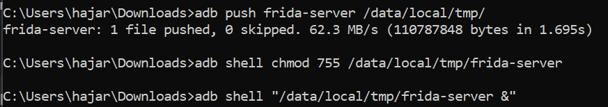

---

## Étape 2 : Visibilité des Processus
Vérification que l'appareil est accessible et liste des packages installés.

> [!NOTE]
> 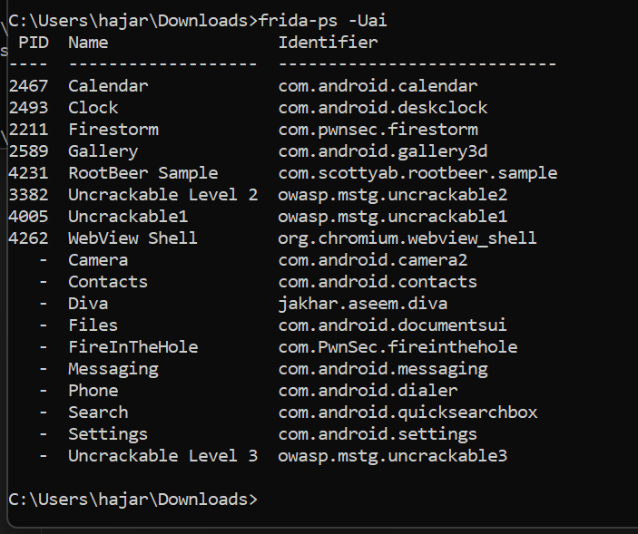

---

## Étape 3 : Mise en œuvre du Framework Medusa

### 3.1 Installation et Préparation
Le framework Medusa a été récupéré depuis son dépôt officiel. Après le clonage, nous avons procédé à l'installation des dépendances nécessaires au bon fonctionnement de l'outil.

**Commandes exécutées :**
```powershell
git clone https://github.com/medusaex/medusa.git
cd medusa
pip install -r requirements.txt
```
> [!NOTE]
> 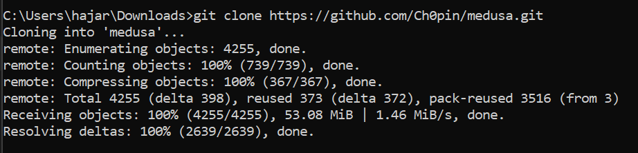
> 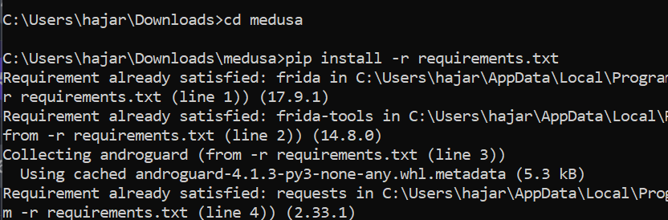
> 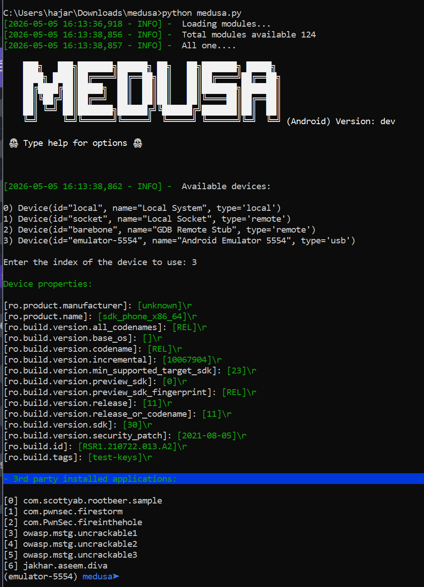

### 3.2 Sélection de la Cible
L'application choisie pour ce laboratoire est **RootBeer Sample**, une référence dans les tests de détection de root. Avant toute intervention de Medusa, l'application détectait l'environnement comme étant "Rooted".
> 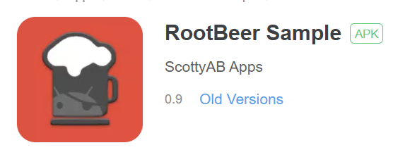

> [!NOTE]
> **État initial de l'application (Rooted) :**

> 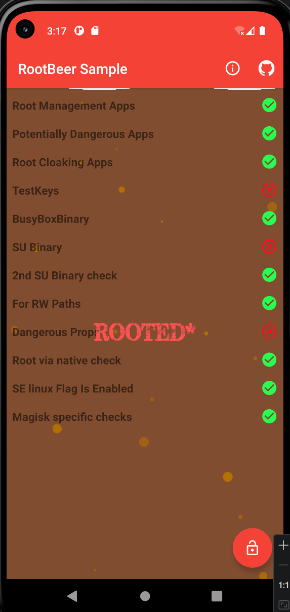

### 3.3 Recherche et Choix des Modules
Nous avons exploré les modules disponibles dans Medusa pour identifier ceux capables de contrer les vérifications de RootBeer.

> [!NOTE]
> 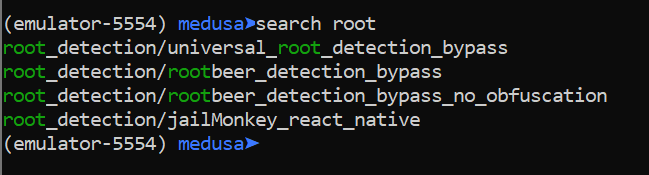


### 3.4 Solution : Bypass via Module No-Obfuscation
L'utilisation du module `root_detection/rootbeer_detection_bypass_no_obfuscation` a permis de stabiliser l'injection et de commencer le contournement des sécurités.

> [!NOTE]
> 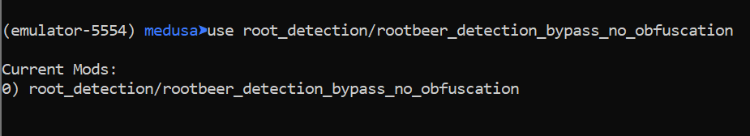


## Étape 5 : Validation Finale

### 5.1 Logs de Succès Medusa
Interception réussie de toutes les méthodes de détection par Medusa.

> [!NOTE]
> 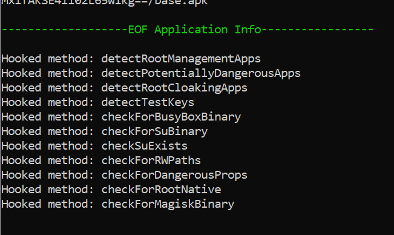

### 5.2 État de l'Application
L'application RootBeer Sample confirme que l'appareil n'est plus détecté comme rooté.

> [!IMPORTANT]
> **Capture finale (100% vert) :**

> 


---

